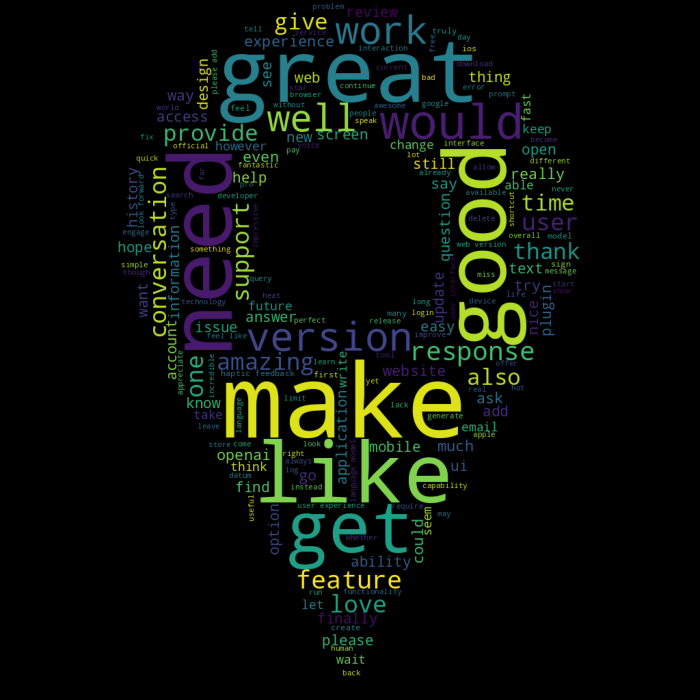
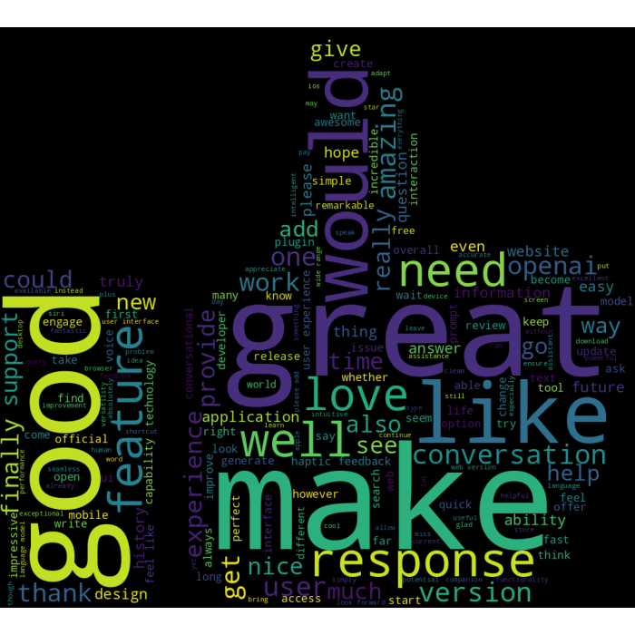
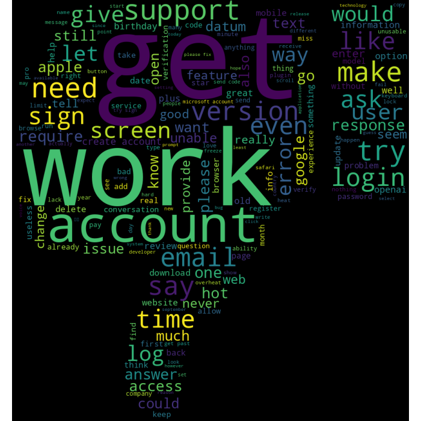

# ChatGPT Review Sentiment Analysis 

## Table of Contents
- [Project Overview](#project-overview)
- [Data Source](#data-source)
- [Implementation Details](#implementation-details)
    - [Technologies](#technologies)
    - [Python Packages Used](#python-packages-used)
- [Steps Followed](#steps-followed)
- [Results](#results)
- [Future Improvements](#future-improvements)

## Project Overview

This project focuses on sentiment analysis of ChatGPT reviews collected from the AppStore. The system analyzes the sentiment of user reviews and classifies them into positive, negative, or neutral categories. 

Sentiment analysis plays a crucial role in understanding public opinion and can provide valuable insights for businesses, marketing campaigns, and decision-making processes.

## Data Source

The dataset for this project was sourced from the AppStore, a popular platform for iOS applications. It consists of user reviews for ChatGPT App. Each review includes the date,review title,review text and the corresponding rating given by the user. 

Collected Data can be find [here](data/chatgpt_reviews.csv).

## Implementation Details

### Technologies
* Python
* Jupyter

### Python Packages Used
* **Data Collection**: app_store_scraper
* **Data Manipulation**: Pandas, numpy
* **Data Preprocessing**: imblearn
* **Machine Learning**: scikit, xgboost
* **Natural Language Processing**: spacy, re, nltk
* **Data Visualisation**: matplotlib, seaborn, wordcloud

## Steps Followed

1. **Data collection**: Collected the ChatGPT reviews data from AppStore.
2. **Data Preprocessing**: Cleaned and preprocessed the raw text data to make it suitable for analysis. Steps include:
    * Removed punctuation, special characters, emojis, stopwords and irrelevant information.
    * Tokenization: Splitting the text into individual words or tokens.
    * Normalization: Applied lemmatization to reduce words to their base or root form.
    * Categorizing the reviews based on their star ratings: 5 and 4 stars as positive sentiment, 3 stars as neutral sentiment, and 1 and       2 stars as negative sentiment.
    * Handled Imbalanced Data: Sentiment classes in the dataset were imbalanced (e.g., significantly more positive reviews compared t negative reviews and  neutral reviews), addressed the issue using techniques such as Synthetic Minority Over-sampling Technique (SMOTE). 
3. **Data Visualization**:  Visualized the reviews, positive, negative, and neutral sentiment using word clouds. This provided an intuitive representation of the most frequent and impactful words associated with each sentiment category.
3. **Model Training**: Implemented and trained various machine learning algorithms such as logistic regression, Multinomial NB, random forests, and XGB.
4. **Model Evaluation**: Assessed the performance of each model using metrics such as accuracy, precision, recall, F1-score. Selected the best-performing model.

## Results

### Reviews WordCloud

### Positive Sentiment WordCloud

### Negative Sentiment WordCloud

### Sentiment Analsysis Results
Based on the evaluation results, the best-performing model was **XGBoost** which achieved an accuracy of 87% and F1-score of more than  85%. 

## Future Improvements
* Increase the Training Data: Collect more diverse and representative user reviews to expand the training dataset. This can help improve the model's generalization and performance on a wider range of reviews.
* Fine-tune the Model: Experiment with different fine-tuning techniques and hyperparameter tuning to enhance the performance of the sentiment analysis model.
* Explore Different Language Models: There are various pre-trained models available, such as BERT, GPT-2, or RoBERTa, which might provide different insights and performance for sentiment analysis tasks.
  

  

